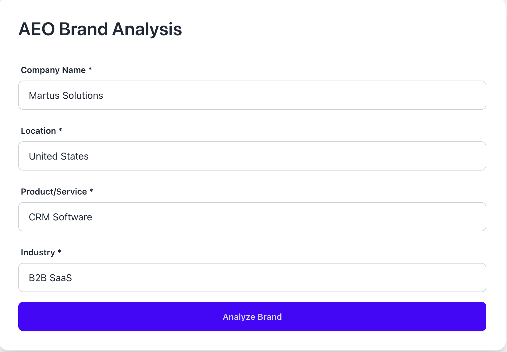
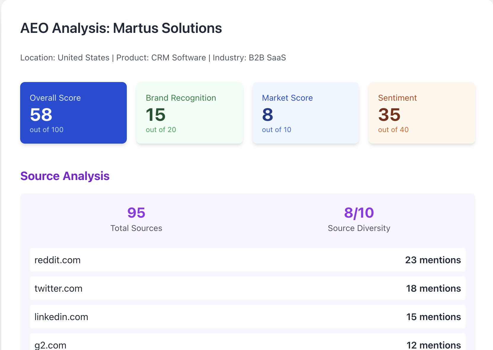

# WebGrader - AEO Brand Analyzer

A proof-of-concept tool for Answer Engine Optimization (AEO) analysis that evaluates a company's positioning for AI-powered search engines.

## Overview

This application generates comprehensive AEO reports by:
1. **Gathering real-time data** via Google Custom Search API (11 parallel queries covering brand recognition, market competition, and sentiment)
2. **AI-powered analysis** using LLM to synthesize search results into actionable insights
3. **Server-rendered UI** with HTMX for fast, interactive form submission without JavaScript frameworks

## Tech Stack

- **Backend**: F# with ASP.NET Core
- **Frontend**: Server-rendered HTML with HTMX, DaisyUI, and Tailwind CSS
- **APIs**: Google Custom Search API, LiteLLM (OpenAI integration)
- **Infrastructure**: Docker Compose

## Screenshots

### Input Form


### Example Report


For a detailed example of the generated report, see [example.pdf](example.pdf).

## Environment Variables

Set the following environment variables before running:

```bash
# Google Custom Search API
export Google__ApiKey="your_google_api_key"
export Google__SearchEngineId="your_search_engine_id"

# LiteLLM Configuration
export LiteLLM__Uri="http://localhost:4000"
export LiteLLM__Model="gpt-5-mini"

# OpenAI API Key (for LiteLLM)
export OPENAI_API_KEY="your_openai_api_key"
```

**Fish shell:**
```bash
set -x Google__ApiKey "your_google_api_key"
set -x Google__SearchEngineId "your_search_engine_id"
set -x LiteLLM__Uri "http://localhost:4000"
set -x LiteLLM__Model "gpt-5-mini"
set -x OPENAI_API_KEY "your_openai_api_key"
```

### Getting API Keys

1. **Google Custom Search API**:
   - Enable Custom Search API in [Google Cloud Console](https://console.cloud.google.com/apis/library/customsearch.googleapis.com)
   - Create an API key at [Credentials](https://console.cloud.google.com/apis/credentials)
   - Create a Custom Search Engine at [Programmable Search Engine](https://programmablesearchengine.google.com/)
   - Note: Requires paid account for production use (free tier: 100 queries/day)

2. **OpenAI API Key**:
   - Get your API key from [OpenAI Platform](https://platform.openai.com/api-keys)

## Running the Application

### Option 1: Docker Compose (Recommended)

```bash
# Build and run
docker-compose up --build

# Access the application
open http://localhost:3000
```

### Option 2: Local Development

```bash
# Build
cd src
dotnet build WebGrader.slnx

# Run
dotnet run --project WebGrader.Api/WebGrader.Api.fsproj

# Access the application
open http://localhost:3000
```

### Option 3: Run Tests

```bash
cd src
dotnet test
```

## How It Works

1. **User submits form** with company name, location, product, and industry
2. **Google Search phase**: Executes 11 parallel queries across three categories:
   - **Brand Recognition** (4 queries): Direct mentions, industry context, "best product" rankings, reviews
   - **Market Competition** (3 queries): Competitor comparisons, alternatives, top companies
   - **Sentiment Analysis** (4 queries): Reviews, complaints, Reddit discussions, testimonials
3. **LLM Analysis phase**: Feeds all search results to LLM with structured prompt
4. **Report Generation**: LLM returns JSON with scores, insights, and recommendations
5. **Score Normalization**: Converts LLM's 0-100 scores to weighted components:
   - Brand Recognition: 0-20 (20% weight)
   - Market Score: 0-10 (10% weight)
   - Sentiment: 0-40 (40% weight)
   - Overall: Sum of normalized scores (max 70)

## Architecture Decisions

### Server-Rendered with HTMX
- **Why**: Fast development, minimal JavaScript, progressive enhancement
- **Benefits**: Simple deployment, works without client-side frameworks, excellent performance
- **Trade-off**: Less interactive than SPA, but sufficient for form-submit-report workflow

### F# with ASP.NET Core
- **Why**: Type safety, functional composition, excellent for data pipelines
- **Benefits**: Strong domain modeling, railway-oriented programming with `Result`, clear data flow
- **Trade-off**: Less common than C#, smaller ecosystem

### Parallel Google Queries
- **Why**: Faster data gathering (11 queries in ~2 batches vs sequential)
- **Benefits**: Reduces total request time from ~11s to ~2-3s
- **Trade-off**: Higher API quota consumption

### LLM for Analysis
- **Why**: Semantic understanding of search results, flexible output formatting
- **Benefits**: Can extract insights from unstructured text, adapts to different industries
- **Trade-off**: Non-deterministic, requires careful prompt engineering

## Known Limitations & Future Improvements

### Current Shortcomings

1. **Score Accuracy**
   - LLM-generated scores are estimates, not based on precise metrics
   - No baseline or historical comparison data
   - Scores may vary between runs for the same input

2. **Data Quality**
   - Limited to top 10 Google results per query (API limitation)
   - No caching - same queries repeated for same company
   - No validation of competitor names or mention counts

3. **Error Handling**
   - Single API failure causes entire analysis to fail
   - No retry logic for transient failures
   - No graceful degradation with partial results

4. **LLM Response Parsing**
   - Strict JSON parsing can fail if LLM deviates from schema
   - `topSources` array format is fragile
   - No schema validation before parsing

5. **Rate Limiting**
   - 11 queries per analysis can exhaust free tier quickly
   - No rate limiting or queue management for multiple users
   - No query result caching

6. **Scalability**
   - Synchronous request processing (blocks during 30-60s analysis)
   - No background job processing
   - No database for storing historical reports

7. **Testing**
   - Limited test coverage
   - No integration tests for full flow
   - No mock data for offline testing

### Potential Improvements

**Short-term:**
- Add caching layer (Redis) for Google search results
- Implement retry logic with exponential backoff
- Add loading progress indicators (% complete)
- Store reports in database for historical comparison
- Add export to PDF functionality

**Medium-term:**
- Background job processing (Hangfire/Azure Functions)
- Competitor tracking over time (trend analysis)
- Multiple LLM providers with fallback (OpenAI → Anthropic → local)
- User authentication and report history
- Batch processing for multiple companies

**Long-term:**
- Real-time monitoring and alerts
- Custom scoring weights per industry
- Integration with actual AEO tools APIs
- Machine learning for score prediction
- Multi-language support

## Project Structure

```
src/
├── WebGrader.Api/          # ASP.NET Core API & Views
│   ├── Controllers/        # MVC Controllers
│   ├── Views/             # Giraffe ViewEngine (HTML)
│   └── Program.fs         # App configuration & DI
├── WebGrader.Core/        # Core business logic
│   ├── Api/               # HTTP clients (Google, LLM)
│   ├── Config/            # Configuration models
│   ├── Extensions/        # Service registration helpers
│   ├── Models/            # Domain models
│   └── Services/          # Business logic (AeoAnalysisService)
└── WebGrader.Tests/       # Unit & integration tests
```

## Sample Analysis Flow

1. Input: "Martus Solutions" (CRM Software, B2B SaaS, United States)
2. Google searches return ~110 results across 11 queries
3. LLM analyzes snippets and generates:
   - Overall Score: 57/70
   - Brand Recognition: 12/20
   - Market Score: 4/10
   - Sentiment: 32/40
   - 6 competitors identified with market share estimates
   - 4 strengths, 4 weaknesses
   - Market opportunities and competitive advantages
4. Report rendered in ~35 seconds

## License

This is a proof-of-concept project created for a job application interview.
